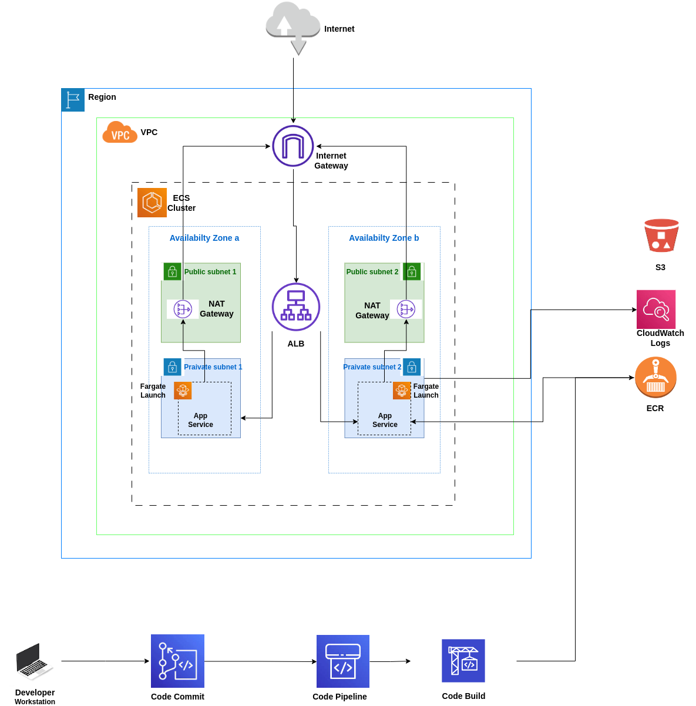

# Hello World
A simple hello world flask app, use terraform as IaC to deploy aws ecs. 
## Architecture
<!--  -->


## Pre-requisite
- Install [terraform v1.5.2](https://www.terraform.io/downloads.html)
- Setup the [aws cli credentials](https://docs.aws.amazon.com/cli/latest/userguide/cli-chap-configure.html) with `default` profile name.

## ECR
Create [ECR](https://aws.amazon.com/ecr/getting-started/) then:
1. Make desired code changes to `src` directory.
2. Run docker build
```bash
cd src; docker build -t <docker_ecr_repo_url>:<version> .
```
3. Docker login into the ECR repo
```bash
aws ecr get-login-password --region <region> | docker login --username AWS --password-stdin <ecr_repo_url>
```
4. Publish docker image 
```bash
docker push <docker_ecr_repo_url>:<version>
```

## Setup infra menual
1. Run the following commands:
``` 
cd terraform
terraform init
terraform validate
terraform apply
```
In the end you will see this message:
```
Apply complete! Resources:  added,  changed,  destroyed.

Outputs:

alb_hostname = "elb-dns.amazonaws.com"
```
2. Copy the alb_hostname and paste it at browser, in few minutes you will see "hello world!" masage on the screen.

## Setup infra auto
1. Use the infra.sh to upload your infra. Run ```./infra.sh help``` to see all commands.

```
       usage: ./infra.sh <command> <option>
       Basic Commands:
       list                    List environments.
       apply                   Create or update default environment.
       destroy                 Destroy default environment.
       workspace <environment> Create or update environments.
```
2. For simple apply run 
```
./infra.sh apply
```
## Use CodePipeline and CodeBuild for CD
Follow this [Tutorial](https://docs.aws.amazon.com/codepipeline/latest/userguide/ecs-cd-pipeline.html).

## Clean up
Run:
```
./infra.sh destroy
```
then menualy delete ecr.
